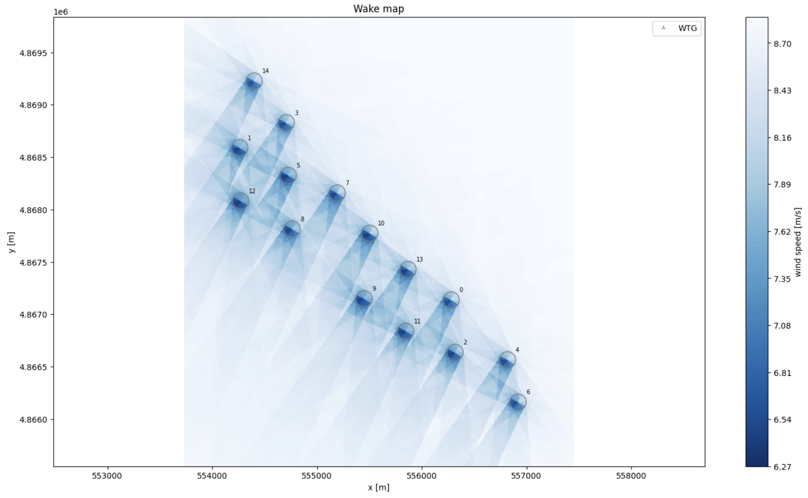

# Modelling Wind Turbines

## Project Summary

This project focuses on modeling the Annual Energy Yield (AEP) of wind turbines located in Croatia. Using wind speed and direction data, the project aims to estimate the potential energy production of wind turbines in this region. The analysis is performed using Python, leveraging libraries such as pandas, numpy, matplotlib, and pywake.

## Objectives
- Load and preprocess wind data for a specified location in Croatia.
- Define the specifications for a wind turbine model.
- Simulate the AEP using the pywake.
- Visualize the relationship between AEP, wind speed, and wind direction.
- 
## Methodology
- Data Loading: Location data is imported from a KML file, where wind data is extracted from GSA API and processed for analysis.
- Turbine Specification: Specifications for the wind turbine model, including type and hub height and power curve are defined.
- Simulation: The wind turbine model is used to simulate the AEP based on the input wind data.
- Visualization: The AEP is plotted against wind speed and direction to provide insights into the turbine's performance.

## Results

The simulation results provide estimates of the AEP for wind speeds and directions extracted from location site. The visualizations help in understanding the potential energy yield of the wind turbine in the given location.

### Wake Map

Description: The wake map provides a visual representation of the wind flow and the resulting wake effect from each wind turbine in the wind farm. The wake effect occurs when the wind passing through the rotor blades of a wind turbine loses speed and causes a reduction in energy for downstream turbines.

Key Elements:

Wind Turbines: Each circle represents a wind turbine, numbered accordingly.
Wake Zones: The shaded areas behind each turbine show the regions affected by the wake, where wind speeds are reduced.
Wind Speed Gradient: The color gradient on the right indicates the wind speed in meters per second (m/s). Darker shades represent lower wind speeds, and lighter shades indicate higher speeds.
Axes: The x-axis and y-axis represent the coordinates in meters (m), indicating the layout of the wind farm.
Insight: This map helps in understanding how the placement of turbines affects their performance. Turbines placed directly behind others are subject to reduced wind speeds, which can decrease their energy output due to the wake effect.

### AEP vs Wind Speed
- X-axis: Wind Speed [m/s]
- Y-axis: AEP [GWh]
- Description: This plot shows the relationship between wind speed and the Annual Energy Yield (AEP). Higher wind speeds generally correspond to higher energy yields.

### AEP vs Wind Direction
- X-axis: Wind Direction [degrees]
- Y-axis: AEP [GWh]
- Description: This plot illustrates the AEP as a function of wind direction. Certain wind directions may lead to higher energy yields depending on the local topography and wind patterns.

## Conclusion
The project successfully models the annual energy yield of wind turbines in Croatia, providing valuable insights into the feasibility and potential of wind energy in the region. The results indicate that both wind speed and direction significantly impact the energy production of wind turbines.
